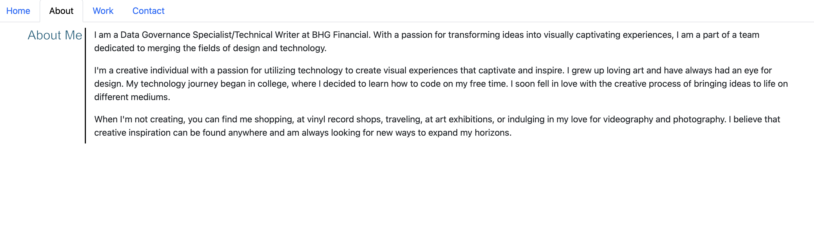

# React + Vite Portfolio

This Portfolio provides a minimal setup to get React working in Vite with HMR and some ESLint rules.

Currently, two official plugins are available:

- [@vitejs/plugin-react](https://github.com/vitejs/vite-plugin-react/blob/main/packages/plugin-react/README.md) uses [Babel](https://babeljs.io/) for Fast Refresh
- [@vitejs/plugin-react-swc](https://github.com/vitejs/vite-plugin-react-swc) uses [SWC](https://swc.rs/) for Fast Refresh

## Description

My motivation was to create a portfolio to showcase my work. I built this project so it could help me organize my work and demonstrate it in an effective way. This problem solves sending in multiple links associated with different projects. I learned how to use logic to meet the criteria associated with making a portfolio.

## Table of Contents (Optional)

- [Installation](#installation)
- [Usage](#usage)
- [Credits](#credits)
- [License](#license)

## Installation

N/A

## Usage

Here is the link to deployed page: [(https://ivega16.github.io/Password-Generator/)]

## Credits

Isabella Vega - https://github.com/ivega16

## License

## Features

Website

## How to Contribute

Isabella Vega

## Tests

Using VS Code
